# 📍 CheckPoint

Aplicativo mobile desenvolvido em Flutter para registrar, compartilhar e acompanhar conquistas relacionadas a visitas nos lugares da PUCMINAS. Este projeto foi criado como parte do **Projeto Integrado I - Engenharia de Computação (PUC Minas - Coração Eucarístico)**.

---

## 📱 Sobre o App

O **CheckPoint** é um app que permite aos usuários:
- Registrar lugares importantes com descrição e lcalização
- Visualizar sua linha do tempo de conquistas
- Editar seu perfil e acompanhar conquistas desbloqueadas
- Navegar facilmente com barra inferior fixa
- Explorar um carrossel de introdução ao abrir o app pela primeira vez

---

## 🚀 Tecnologias utilizadas

- **Flutter** — Framework principal
- **Dart** — Linguagem de programação
- **SQLite** — Banco de dados local
- **Firebase Auth & Firestore** — Autenticação e banco de dados em nuvem
- **Mapbox** — Exibição e marcação de locais no mapa
- **Geolocator / Permission Handler** — Acesso à localização
- **Plataformas:** Android e iOS

## ⚙️ Como rodar o projeto

1. Clone o repositório:
```bash
git clone https://github.com/seu-usuario/checkpoint.git
cd checkpoint/checkpointapp
```
   
2. Va para a pasta chechpoink app instale as dependências e execute o aplicativo:
```bash
flutter pub get
flutter run
```

---

## 🧪 Funcionalidades principais

- [x] Cadastro, login e restore de senha de usuário  (via Firebase)
- [x] Timeline com postagens
- [x] Perfil do usuário com edição de dados pessoais
- [x] Conquistas visuais desbloqueáveis
- [x] Mapa com pontos salvos
- [x] Tela "Sobre o App" com carrossel
- [x] Navegação intuitiva por `BottomNavigationBar`

---

## 🌱 Relação com os Objetivos de Desenvolvimento Sustentável (ODS)

O projeto **CheckPoint** se alinha a alguns dos Objetivos de Desenvolvimento Sustentável da Agenda 2030 da ONU, promovendo o uso da tecnologia para o bem social, educacional e ambiental. A seguir, destacamos os principais ODS relacionados:

### 🎓 ODS 4 – Educação de Qualidade  
**Assegurar a educação inclusiva e equitativa de qualidade, e promover oportunidades de aprendizagem ao longo da vida.**  
> O aplicativo incentiva os estudantes da PUC Minas a explorarem o campus e seus espaços históricos, culturais e acadêmicos, promovendo o **engajamento educacional** e a valorização do ambiente universitário.


### 🏙️ ODS 11 – Cidades e Comunidades Sustentáveis  
**Tornar as cidades e os assentamentos humanos inclusivos, seguros, resilientes e sustentáveis.**  
> Ao promover o reconhecimento de pontos culturais e locais de interesse dentro da universidade, o CheckPoint contribui para a valorização do espaço sustentável educacional.


Saiba mais sobre os ODS: [https://brasil.un.org/pt-br/sdgs](https://brasil.un.org/pt-br/sdgs)

---

## 📱 Arquitetura do projeto

<p align="center">
  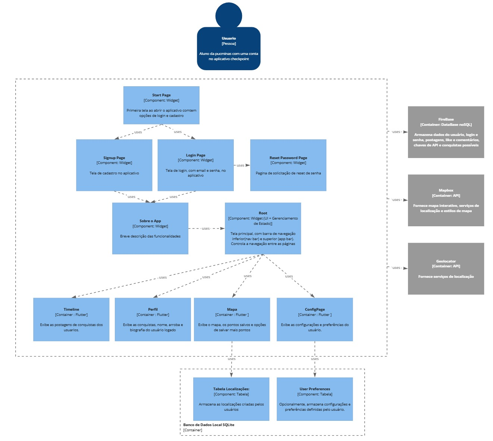
</p>

---

## 📸 Capturas de tela


| 1. Página Inicial | 2. Tela de Login | 3. Tela de Cadastro |
| :---: | :---: | :---: |
| 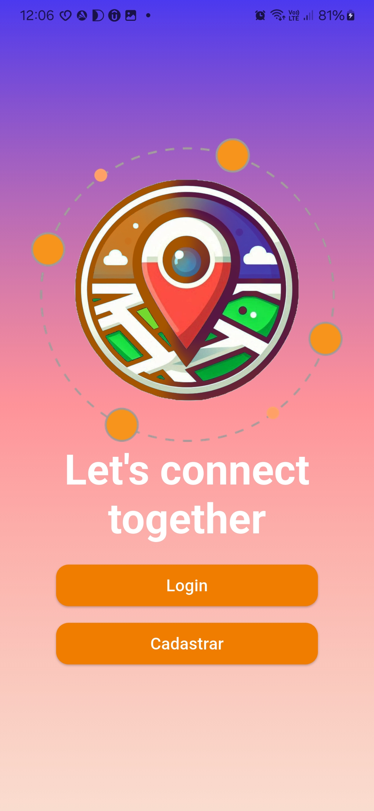 | 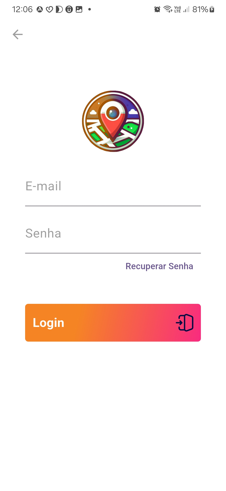 | 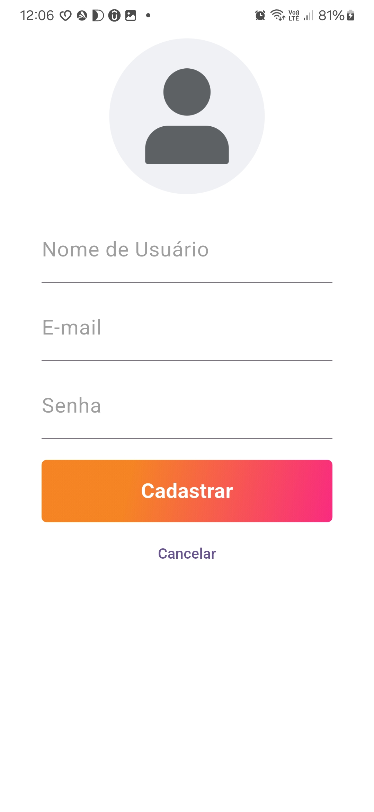 |

<br>

| 4. Timeline Social | 5. Tela de Comentários | 6. Mapa Interativo |
| :---: | :---: | :---: |
| 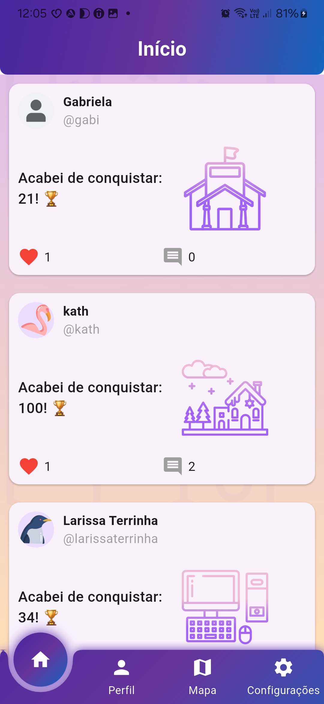 | 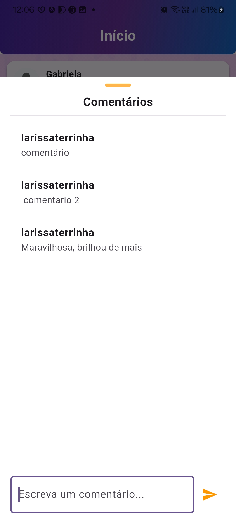 | 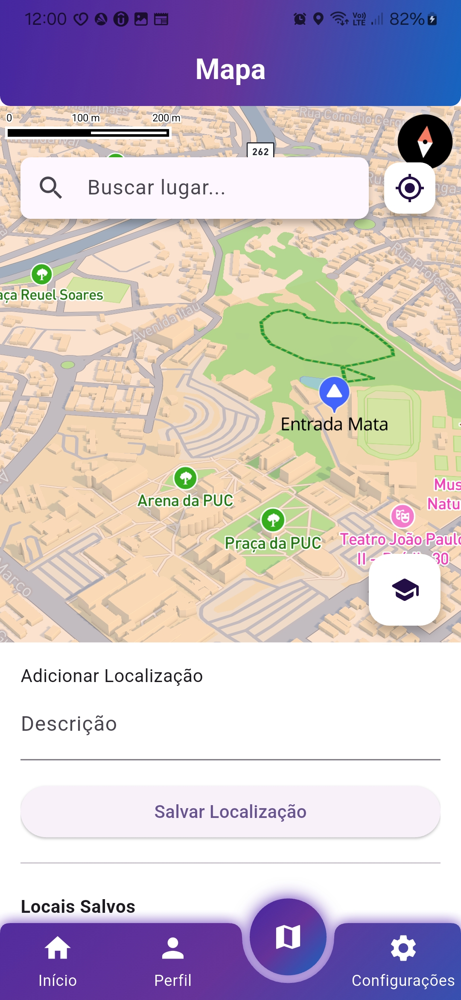 |

<br>

| 7. Interação no Mapa (Pin) | 8. Pin Selecionado | 9. Perfil do Usuário |
| :---: | :---: | :---: |
| 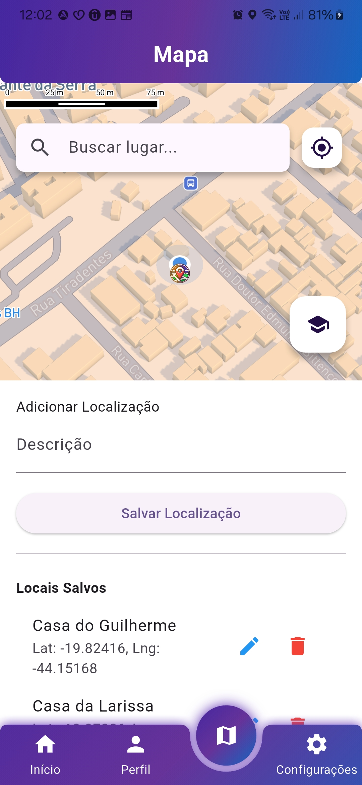 | 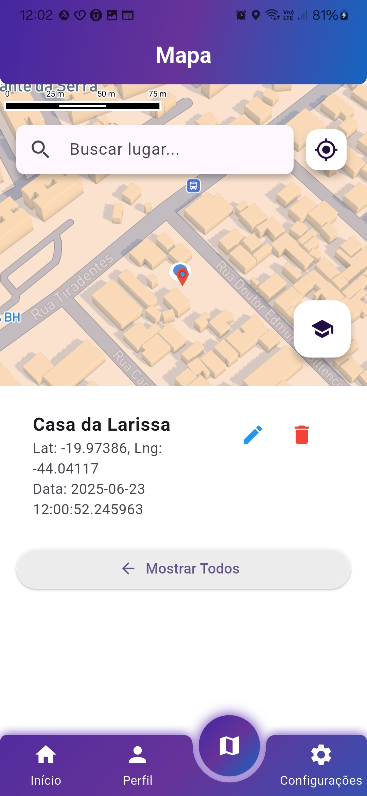 | 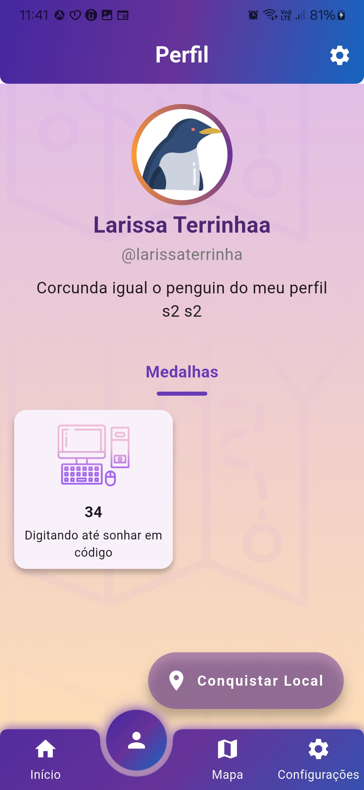 |

<br>

| 10. Edição de Perfil | 11. Configurações Gerais | 12. Recuperação de Senha |
| :---: | :---: | :---: |
| 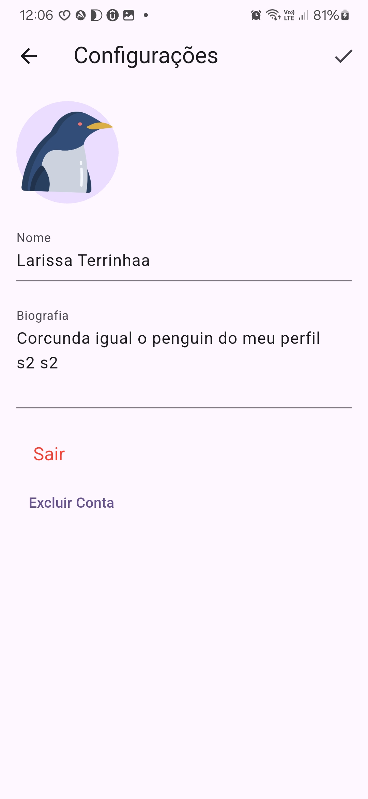 | 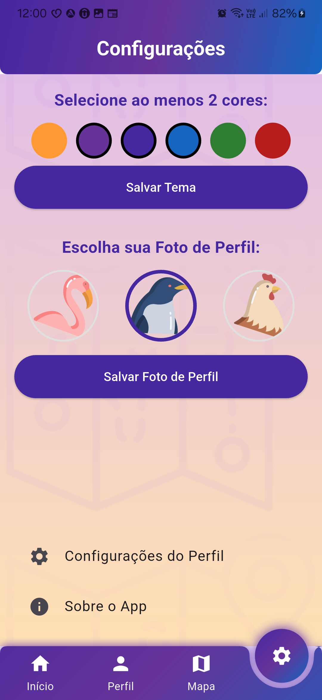 | 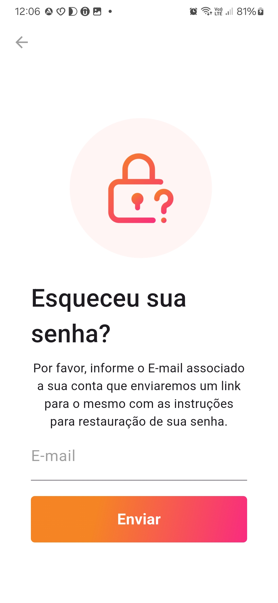 |


---

## 🗂️ Estrutura do Repositório

```bash


Respositorio:.
│   CheckPoint.png	// Logo do aplicativo
│   gitignore
│   README.md
│
└───checkpointapp	// Pasta de Desenvolvimento
    │
    ├───assets		// Imagems do aplictivo
    │
    │       CheckPoint.png
    │       ...
    │
    ├───lib		// Codigo pricipal do projeto em DART
    │   │
    │   │   Configuracoes.dart
    │   │   firebase_options.dart
    │   │   main.dart
    │   │   root.dart              // Pagina pricipal que chama as demais telas
    │   │   sobre_o_app.dart
    │   │
    │   ├───BancoDeDados
    │   │       auth_service.dart
    │   │       Localizacoes.dart
    │   │       user_firestore_service.dart
    │   │       user_preferences_services.dart
    │   │
    │   ├───login
    │   │       login_page.dart
    │   │       reset_password_page.dart
    │   │       signup_page.dart
    │   │       start_page.dart
    │   │
    │   ├───Mapa
    │   │       location_bottom_sheet.dart
    │   │       map.dart
    │   │       search_place.dart
    │   │
    │   ├───Profile
    │   │       configuracoes_perfil.dart
    │   │       Conquistas.dart
    │   │       grade_de_fotos.dart
    │   │       imagem_ampliada.dart
    │   │       quadrados_das_fotos.dart
    │   │       tela_perfil.dart
    │   │
    │   └───timeline
    │           pagina_comentarios.dart
    │           postcard.dart
    │           timeline.dart
    │
    ├───ios 			// Programa para IOS
    │
    ├───android 		// Programa para android
    │
    └─── pubspec.yaml 		// Arquivo de configurações pricipal
	

```

